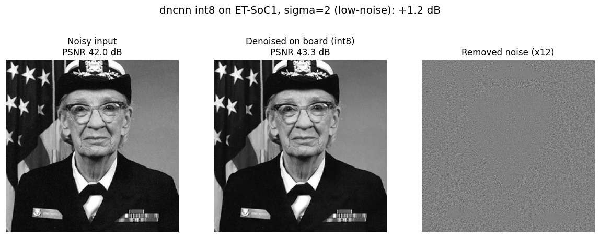

# Example: denoising a real photo on the board

The denoised image is produced by our submitted int8 kernel running on the **ET-SoC1 board** (the
exact ELF this PR builds), not by the reference model. The board processes 64x64 tiles, so the
256x256 photo is split into 16 tiles, each denoised on the board, then stitched back together.

Three files:

| file | what it is |
|---|---|
| `input.png` | the noisy input fed to the board |
| `denoised.png` | the board output (stitched from 16 tiles) |
| `comparison.png` | input, board-denoised, and the removed noise (amplified) side by side |

## This is a low-noise model

`deepinv/dncnn` (`dncnn_sigma2_gray.pth`) is trained for **sigma = 2** (out of 255) - very light
noise. So the denoising is deliberately gentle: on this photo the input is already 42.0 dB and the
board lifts it to 43.3 dB (+1.2 dB). The change is subtle by design, which is why the third panel
amplifies the removed noise 12x so you can actually see what the board took out - a noise-like
residual concentrated in the smooth regions (face, background), with the edges left intact. Do not
expect a dramatic clean-up; this model removes small amounts of noise without blurring detail.

Source photo: Grace Hopper (US Navy, public domain), bundled with matplotlib.
